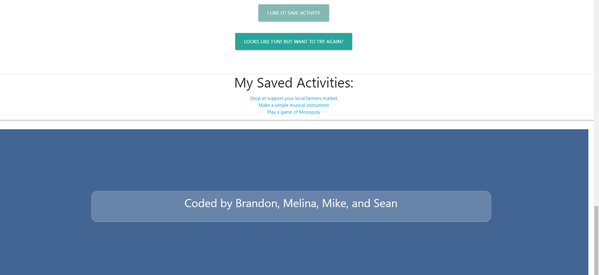

# Activity Selector

This is an App you can use to take the mental work out of choosing an activity to do.  You can select from 8 different activity categories including: Charity, Cooking, DIY, Education, Music, Recreational, Relaxation, and Social.  Once you select a category, the App uses the Bored API to suggest an activity for you.  The activity is shown along with a price  (ranging from free, up to three dollar icons to represent relative cost of the activity).  Also shown are one to several person icons to represent how many participants can partake in the suggested activity, along with an inspirational photograph to go along with the activity category chosen.  If you like the activity suggested, you can save it to local storage by pushing the "I Like It! Save Activity" button and the activity will be saved in local storage and shown in a link in the My Saved Activities section.  Clicking on a saved activity will open up a new window with a pre-populated google search of that activity. 

## Technologies
Technologies used for this App included HTML5, CSS, Javascript, Materialize, Bored API, and the Unsplash API.

LINK TO LIVE PROJECT:

https://melinamboedecker.github.io/ActivitySelector/

## Contributors
Brandon Cowley, Mike Zadra, Sean Mandell, and Melina Boedecker

## License
Copyright (c) 2021 Melina Boedecker
Licensed under the MIT license.

