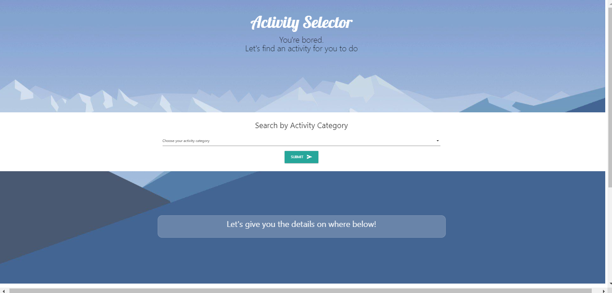

# Activity Selector

This is an App you can use when you can't think of what to do. You can select from 8 different activity categories including: Charity, Cooking, DIY, Education, Music, Recreational, Relaxation, and Social.  Once you select a category, the App uses the Bored API to suggest an activity for you.  The activity is shown along with a price  (ranging from free, up to three dollar icons to represent relative cost of the activity).  Also shown are one to several person icons to represent how many participants can partake in the suggested activity, along with an inspirational photograph to go along with the activity category chosen.  If you like the activity suggested, you can save it to local storage by pushing the "I Like It! Save Activity" button and the activity will be saved in local storage and shown in a link in the My Saved Activities section.  Clicking on a saved activity will open up a new window with a pre-populated google search of that activity. 
​
For our first group project, we were given the task of collaboratively creating an interactive webpage that will call on multiple APIs to create a functional, useful web application. Requirements were that we use a framework other than Bootstrap, deliver a polished UI, and be intuitive for the user to quickly understand the purpose of the site itself.

In completing this project, we now have an application that can take the mental work out of choosing an activitiy to participate in. A user can visit our site, readily understand how to use the site, and pull a random activity out of 8 genres.

In building this page and designing it, we had three areas to work with - first was to learn a new framework outside of Bootstrap - we chose Materialize upon the recommendation of a couple of instructors. Second was to accurately call and implement two different APIs and display their data into the site itself. Lastly, we had to collaboratively learn how to use GitHub with multiple branches and coordinate our activity so as not to disrupt our progress.

As a group, we all were able to grow our skillsets, build on our knowledge of GitHub and code formatting, and communicate in a constructive way!

## Technologies
Technologies used for this App included HTML5, CSS, Javascript, Materialize, Bored API, and the Unsplash API.

LINK TO LIVE PROJECT:

https://melinamboedecker.github.io/ActivitySelector/

## Contributors
Brandon Cowley, Mike Zadra, Sean Mandell, and Melina Boedecker

## License
Copyright (c) 2021 Melina Boedecker
Licensed under the MIT license.

